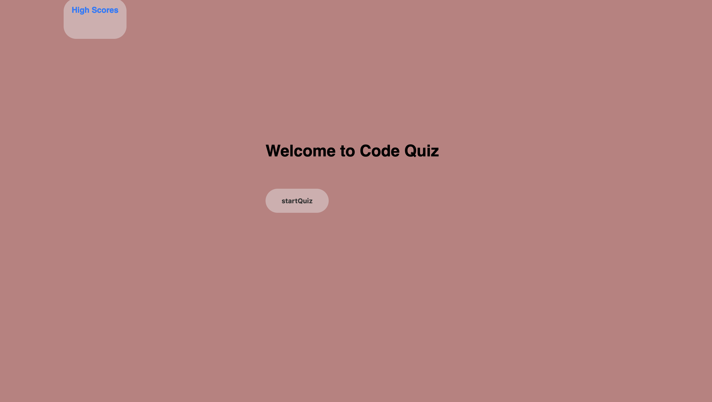
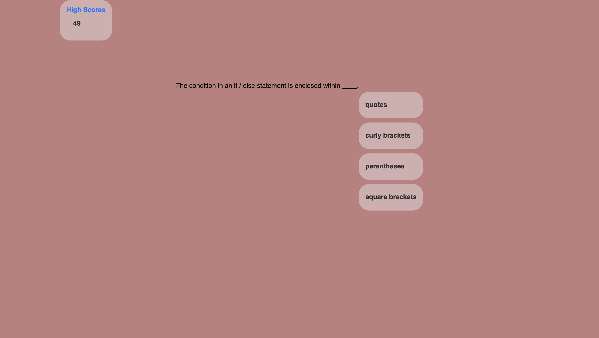

# webapi-quiz-week4

# Code Quiz

Code Quiz is a quiz game designed to test your knowledge of coding concepts. It is a simple web-based game with multiple-choice questions.

## Getting Started

To play the game, simply click on the `startQuiz` button on the welcome screen. You will be presented with a series of multiple-choice questions related to coding concepts. You have 75 seconds to answer all the questions. The timer is displayed at the top of the page.

## Rules

The rules of the game are simple:

- You have 75 seconds to answer all the questions.
- Each question has four possible answers, and you need to select one.
- Once you have answered a question, the next one will be displayed automatically.
- If you answer a question correctly, you will be awarded one point.
- If you answer a question incorrectly, you will lose 10 seconds from the timer.

## Saving Scores

After you have answered all the questions or the time has run out, you will be prompted to save your score. You will be asked to enter your initials, and your score will be added to the high scores list. You can view the high scores by clicking on the `High Scores` link in the top right corner of the screen.

## Built With

This game was built with HTML, CSS, and JavaScript.

## Authors

- Tobenna

## Links

http://127.0.0.1:5500/index.html

## Acknowledgments

- This project was inspired by the need for a fun and interactive way to test coding knowledge.
